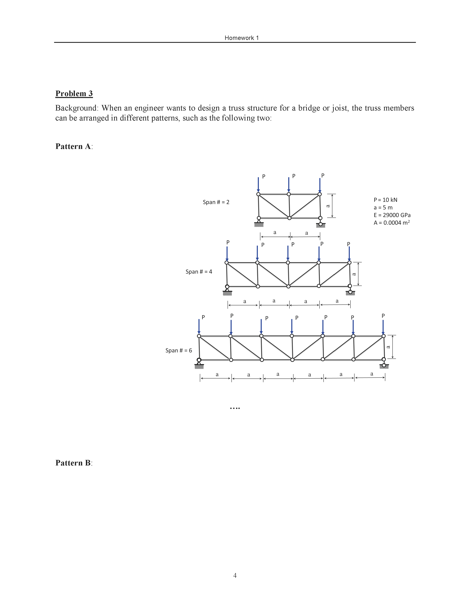
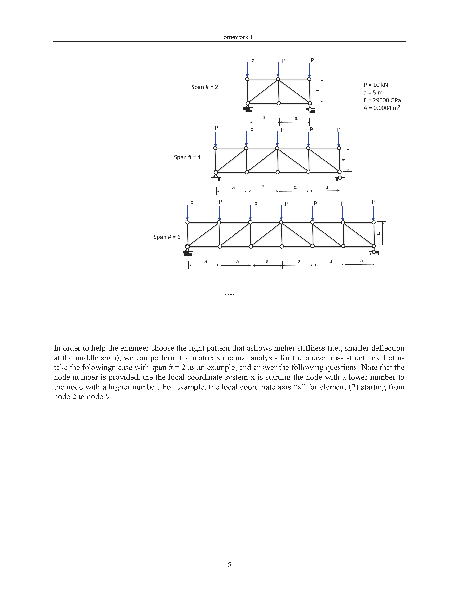
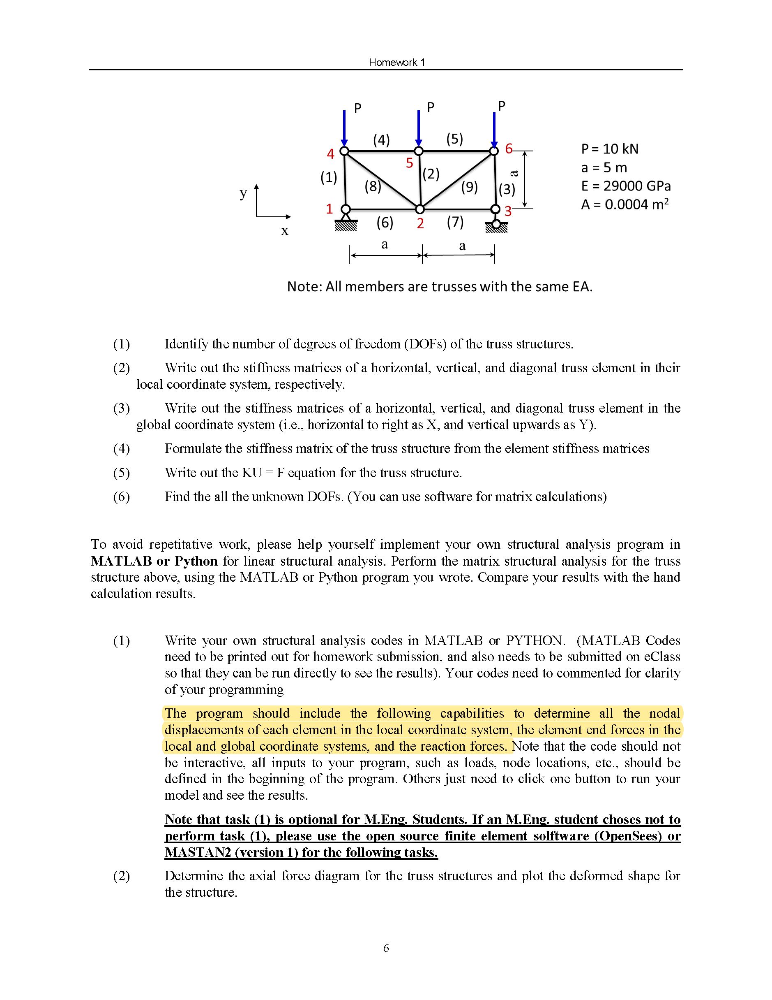
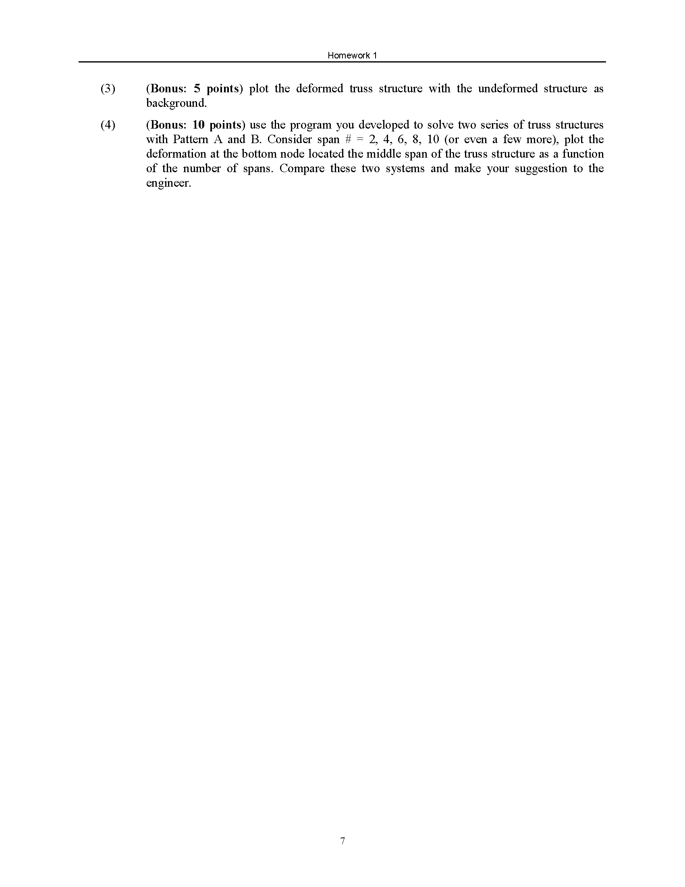
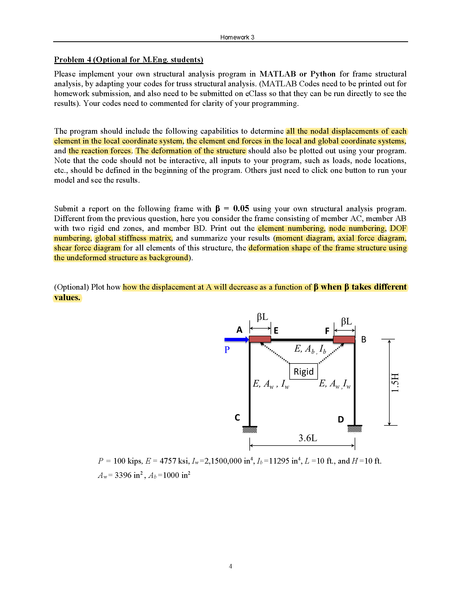

## Course Information

* Course name: CIV E 660 - Advanced Structural Analysis

* Instructor: Yong Li, PhD, PEng

    Associate Professor, Faculty of Engineering - Civil and Environmental Engineering Department in University of Alberta.
    
* Course description:

    Direct stiffness theory and modeling of three dimensional framed structures. Linear and nonlinear stability concepts. Approximate and Direct stiffness formulation of geometric nonlinear problems.

## Problem Statement

### Problem 1

#### Problem 1 MATLAB code

#### Pattern 3

#### main

* Parameters configuration

* Define the concentrated force boundary [node number, force, dimension of DOF](vertical direction）

* Generate the node number corresponding to each element

* The concentrated force boundary is introduced to calculate F

* Calculate element stiffness matrix k

* Assemble global stiffness matrix K(ID array approach)

* Diagonal elements change 1 to introduce displacement boundary

* Solve for KU=P, to generate the nodal displacements in the global coordinate system

* Determine nodal displacements of each element in the local coordinate system

* Determine the element end forces in the local and global coordinate system

* Determine the reaction forces of support 1 and 3

* Determine axial forces of each element

* Plot the axial force diagram

* Plot the deformed truss structure with the undeformed structure as background

#### Function

* mesh_def
    
    This function defines the node number corresponding to each element.
    
    
* cal_k_local

    This function generates stiffness matrix for each element in local coordinate system.
    
    
* cal_k

    This function generates stiffness matrix for each element in global coordinate system.
    
    
* trans

    This function defines transformation matrix for an element-end displacement vector from a global coordinate system to local coordinate system.
    
    
* disp_cal
 
     This function determines nodal displacements of each element in the local coordinate system.
     
     
* f_local_cal
 
     This function determines element end forces in the local coordinate system.
     
     
* f_global_cal

    This function determines element end forces in the global coordinate system
    
    
* axial_f_cal
 
     This function generates axial forces of each element.
     
     
* mesh_plot

    This function stores coordinates of each node.

#### Pattern n

#### main

* Parameters configuration

* Define the concentrated force boundary [node number, force, dimension of DOF](vertical direction）

* Generate the node number corresponding to each element

* The concentrated force boundary is introduced to calculate F

* Calculate element stiffness matrix k

* Assemble global stiffness matrix K

* Diagonal elements change 1 to introduce displacement boundary

* Solve for KU=P, to generate U

* Print the the deformation at the bottom node located at the middle span of the truss structure

#### Function

* mesh_def

    This function defines the node number corresponding to each element.
    
    
* force_boundary

    This function returns force array.
    
    
* cal_k

    This function generates stiffness matrix for each element in global coordinate system.

#### Visualization

* Load_Displacement_curve

### Problem 2

#### Problem 2 MATLAB code

#### main

* Parameters configuration

* Define the concentrated force boundary [node number, force, dimension of DOF]

* Generate the node number corresponding to each element

* The concentrated force boundary is introduced to calculate F

* Calculate element stiffness matrix k

* Assemble global stiffness matrix K(ID array approach)

* Diagonal elements change 1 to introduce displacement boundary

* Solve for KU=P, to generate the nodal displacements in the global coordinate system

* Determine nodal displacements of each element in the local coordinate system

* Determine the element end forces in the local and global coordinate system

* Determine the reaction forces of support 1 and 6

* Plot the axial force diagram

* Plot the shear force diagram

* Plot the bending moment diagram

* Plot the deformed truss structure with the undeformed structure as background

#### main_1

* To generate how the displacement at A will decrease as a function of β when β takes different values

#### Function

* ugenerator

    This function returns the displacement at A when β takes different values.
    
* cal_k

    This function generates stiffness matrix for each element in global coordinate system.
    
* cal_k_local

    This function generates stiffness matrix for each element in local coordinate system.
    
* disp_cal

    This function determines nodal displacements of each element in the local coordinate system.
    
* f_global_cal

    This function determines element end forces in the global coordinate system.
    
* f_local_cal

    This function determines element end forces in the local coordinate system.
    
* mesh_def

    This function defines the node number corresponding to each element.
    
* mesh_plot

    This function stores coordinates of each node.
    
* mesh_plot_ex

    This function stores coordinates of each node.
    
* trans

    This function defines transformation matrix for an element-end displacement vector from a global coordinate system to local coordinate system.

### Contact Me

MEng (Structural Engineering) student in University of Alberta **Haoran Liang**: hliang7@ualberta.ca.
